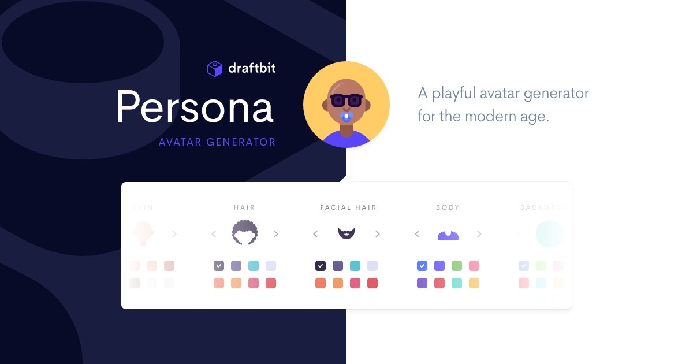

# Personas by Draftbit

A delightful avatar generator by the folks at Draftbit. Try it online at [https://personas.draftbit.com](https://personas.draftbit.com)

## Contributing

Personas is built using Gatsby and Rescript. Setup instructions are straight forward:

- `yarn`
- `yarn develop` starts the Gatsby server
- `yarn re:watch` starts the Rescript compiler

> Note that the first time you get set up you'll need to run `npx patch-package`
> to fix an error with one of `avatar-generator`'s dependencies.

## Why

- We were exploring Reason/Rescript
- We wanted to put together an inclusive avatar generator for placeholders and profile photos
