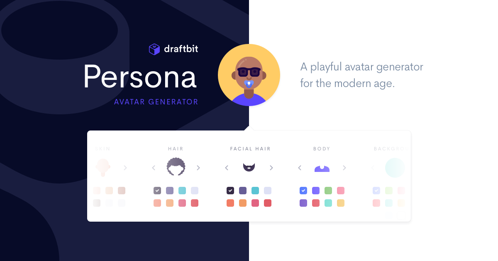

# Personas by Draftbit

A delightful avatar generator by the folks at Draftbit. Try it online at [https://personas.draftbit.com](https://personas.draftbit.com)

## Contributing

Personas is built with [ReScript](https://rescript-lang.org), React 18, and [Vite](https://vite.dev). You'll need Node 22+ (see `.nvmrc`) and Yarn 4 (via `corepack enable`).

- `yarn` installs dependencies
- `yarn re:watch` starts the ReScript compiler in watch mode
- `yarn dev` starts the Vite dev server (run alongside `re:watch`)
- `yarn build` produces a production build in `dist/`
- `yarn preview` serves the production build locally

## Deployment

The site deploys to [Cloudflare Workers](https://developers.cloudflare.com/workers/static-assets/) as a static-assets Worker. Pushes to `master` deploy automatically via GitHub Actions (`.github/workflows/deploy.yml`), which requires the `CLOUDFLARE_API_TOKEN` and `CLOUDFLARE_ACCOUNT_ID` repo secrets. You can also deploy manually with `yarn deploy`.

## Why

- We were exploring Reason/Rescript
- We wanted to put together an inclusive avatar generator for placeholders and profile photos
